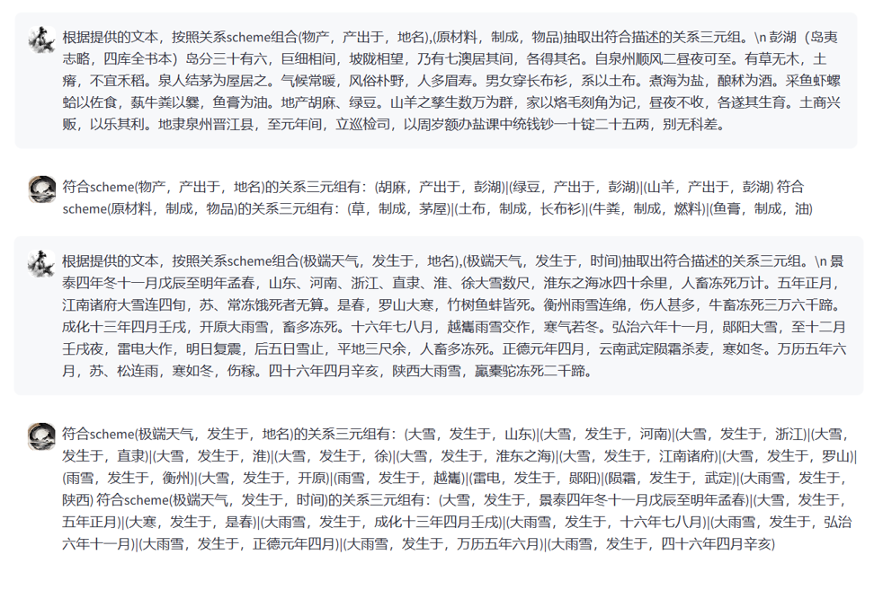

# Xunzi_for_ancient_chinese_relation_extraction
本项目是研究“基于大语言模型技术的古籍限定域关系抽取及应用研究”的对应开源项目。

该研究基于荀子系列模型训练了古籍限定域关系抽取模型、训练语料自动生成模型和训练语料质量评估模型三种大语言模型。

项目仓库公开了研究所构建的三种大语言模型和基于大语言模型生成的训练数据。

# 模型下载路径
逐步发布中，请耐心等待...

当前已发布的关系抽取大模型:

| 模型名称                       | 下载链接                                                     |模型能力          |
| :----------------------------- | :----------------------------------------------------------- | :----------------|
|Xunzi_Qwen_7b_relation_rxtraction   | [链接](https://modelscope.cn/models/shenxin0925/Xunzi_Qwen_7b_relation_rxtraction) |根据用户提供的关系scheme列表抽取古籍中的关系三元组|


# 关系抽取效果展示


# 关系抽取模型使用
## transformers推理代码
```python
import torch
from transformers import AutoModel, AutoTokenizer,AutoModelForCausalLM
from transformers.generation import GenerationConfig
def get_model():
    tokenizer = AutoTokenizer.from_pretrained(model_path, trust_remote_code=True)
    model = AutoModelForCausalLM.from_pretrained(model_path, trust_remote_code=True).cuda()
    model = model.eval()
    return tokenizer, model

# 加载Xunzi的model和tokenizer
tokenizer, model = get_model()
config = GenerationConfig.from_pretrained(model_path, trust_remote_code=True, resume_download=True)

input_text='根据提供的文本，按照关系scheme组合(人物, PO/官職, 官職),(人物, PP/態度傾向/消極, 人物),(人物, PL/其他, 地点),(人物, PL/居, 地点),(人物代词, 態度傾向/消極, 人物)抽取出符合描述的关系三元组\n奏上，上令公卿列侯宗室集議，莫敢難，獨竇嬰爭之，由此與錯有卻。'
response, history = model.chat(tokenizer,input_text, history=None)
print(response)
#输出："符合scheme(人物, PO/官職, 官職)的关系三元组有：无。\n符合scheme(人物, PP/態度傾向/消極, 人物)的关系三元组有：(竇嬰, PP/態度傾向/消極, 錯)\n符合scheme(人物, PL/其他, 地点)的关系三元组有：无。\n符合scheme(人物, PL/居, 地点)的关系三元组有：无。\n符合scheme(人物代词, 態度傾向/消極, 人物)的关系三元组有：无。"
```

## vllm加速推理
```python
from vllm import LLM, SamplingParams
import json
from argparse import ArgumentParser
from transformers import AutoConfig, AutoTokenizer, AutoModelForCausalLM, TextIteratorStreamer, GenerationConfig
from peft import PeftModel

#示例数据：
# prompts = [
# "<|im_start|>system:You are a helpful assistant.<|im_end|> \n <|im_start|>user:根据提供的文本，按照关系scheme(人物名, 隶属于, 人物名)抽取出符合描述的关系三元组\n布收其使，上其书。术怒，攻布，为布所破。秋九月，术侵陈，公东征之。术闻公自来，弃军走，留其将桥蕤、李丰、梁纲、乐就 <|im_end|>\n <|im_start|>assistant:",
# "<|im_start|>system:You are a helpful assistant.<|im_end|> \n <|im_start|>user:根据提供的文本，按照关系scheme(人物名, 任职, 官职名)抽取出符合描述的关系三元组\n其后十六年而秦灭赵。其后二十馀年，高帝过赵，问“乐毅有后世乎”对曰“有乐叔”高帝封之乐卿，号曰华成君。华成君，乐毅之孙也 <|im_start|>assistant:",
# "<|im_start|>system:You are a helpful assistant.<|im_end|> \n <|im_start|>user:根据提供的文本，按照关系scheme(人物名, 位于, 地名)抽取出符合描述的关系三元组\n齐人茅焦说秦王曰“秦方以天下为事，而大王有迁母太后之名，恐诸侯闻之，由此倍秦也”秦王乃迎太后於雍而入咸阳，复居甘泉宫。 <|im_end|>\n <|im_start|>assistant:"
# ]


def _get_args():
    parser = ArgumentParser()
    parser.add_argument("--model_path", type=str)
    parser.add_argument("--input_path", type=str)
    parser.add_argument("--output_path", type=str)


    args = parser.parse_args()
    return args

args = _get_args()


def get_json(input):
    with open(input, 'r', encoding='utf-8') as file:
        data = json.load(file)
    return data    

def qwen_sample(input):
    prompts=[]
    outputs=[]
    input_texts=[]
    for i in input:
        instruction=i['instruction']
        input_text=i['input']
        output=i['output']
        prompt='<|im_start|>system\nYou are a helpful assistant.<|im_end|>\n<|im_start|>user\n{}\n{}<|im_end|>\n<|im_start|>assistant\n'.format(instruction,input_text)    
        prompts.append(prompt)
        outputs.append(output)
        input_texts.append(input_text)
    return prompts,outputs,input_texts
    
data=get_json(input=args.input_path)
prompts,output_raw,input_texts=qwen_sample(input=data)
# print(prompts)

sampling_params = SamplingParams(temperature=1, top_p=0.8,max_tokens=2048,stop=["<|endoftext|>"])

llm = LLM(model=args.model_path,trust_remote_code=True,tensor_parallel_size=1)
outputs = llm.generate(prompts, sampling_params)
output_predicate=[]
#Print the outputs.
for output in outputs:
    prompt = output.prompt
    generated_text = output.outputs[0].text
    output_predicate.append(generated_text)
with open(args.output_path,'w', encoding='utf-8') as fp:
    for i in range(0,len(output_predicate)):
        data={'text':input_texts[i],'raw':output_raw[i],'predicate':output_predicate[i]}
        jsonstr=json.dumps(data, ensure_ascii=False)
        fp.write(jsonstr+'\n')
```
